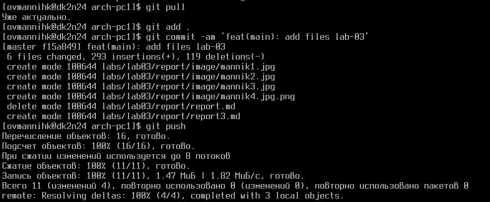

---
## Front matter
title: "Язык разметки Markdown"
subtitle: "Лабораторная работа No 3"
author: "Маннык Очур Викторович"

## Generic otions
lang: ru-RU
toc-title: "Содержание"

## Bibliography
bibliography: bib/cite.bib
csl: pandoc/csl/gost-r-7-0-5-2008-numeric.csl

## Pdf output format
toc: true
toc-own-page: true
toc: true # Table of contents
toc-depth: 2
lof: true # List of figures
lot: true # List of tables
fontsize: 12pt
linestretch: 1.5
papersize: a4
documentclass: scrreprt

## I18n polyglossia
polyglossia-lang:
  name: russian
  options:
      - spelling=modern
      - babelshorthands=true
polyglossia-otherlangs:
  name: english

## I18n babel
babel-lang: russian
babel-otherlangs: english

## Fonts
mainfont: DejaVuSerif
romanfont: Times New Roman
sansfont: DejaVuSans
monofont: DejaVuSansMono
mainfontoptions: Ligatures=TeX
romanfontoptions: Ligatures=TeX
sansfontoptions: Ligatures=TeX,Scale=MatchLowercase
monofontoptions: Scale=MatchLowercase,Scale=0.9

## Biblatex
biblatex: true
biblio-style: "gost-numeric"
biblatexoptions:
  - parentracker=true
  - backend=biber
  - hyperref=auto
  - language=auto
  - autolang=other*
  - citestyle=gost-numeric

## Pandoc-crossref LaTeX customization
figureTitle: "Рис."
tableTitle: "Таблица"
listingTitle: "Листинг"
lofTitle: "Список иллюстраций"
lotTitle: "Список таблиц"
lolTitle: "Листинги"

## Misc options
indent: true
header-includes:
  - \usepackage{indentfirst}
  - \usepackage{float} # keep figures where there are in the text
  - \floatplacement{figure}{H} # keep figures where there are in the text
---

# Цель работы

Целью работы является освоение процедуры оформления отчетов с помощью легковесного
языка разметки Markdown.

# Теоретическое введение

## Базовые сведения о Markdown

Чтобы создать заголовок, используйте знак #, например:


<br>

- Чтобы задать для текста полужирное начертание, заключите его в двойные звездочки:
  This text is **bold**. (** **)<br>
- Чтобы задать для текста курсивное начертание, заключите его в одинарные звездочки:
  This text is *italic*. (* *)<br>
- Чтобы задать для текста полужирное и курсивное начертание, заключите его в тройные звездочки:
- This is text is both ***bold and italic***. (*** ***)<br>
  
  <hr>

Блоки цитирования создаются с помощью символа >:

> The drought had lasted now for ten million years, and the reign of the
>         terrible lizards had long since ended. Here on the Equator, in the
>         continent which would one day be known as Africa, the battle for existence
>         had reached a new climax of ferocity, and the victor was not yet in sight.
>         In this barren and desiccated land, only the small or the swift or the
>         fierce could flourish, or even hope to survive.

Упорядоченный список можно отформатировать с помощью соответствующих цифр:

1. First instruction 
   2.      Sub-instruction
   3.      Sub-instruction
2.      Second instruction

Чтобы вложить один список в другой, добавьте отступ для элементов дочернего списка:

1.      First instruction
2.      Second instruction
3.      Third instruction

Неупорядоченный (маркированный) список можно отформатировать с помощью звездочек или тире:

    * List item 1
    * List item 2
    * List item 3

Чтобы вложить один список в другой, добавьте отступ для элементов дочернего списка:

    - List item 1
    - List item A
    - List item B
    - List item 2

Синтаксис Markdown для встроенной ссылки состоит из части [link text], представляющей текст гиперссылки, и части (file-name.md) – URL-адреса или имени файла, на который дается ссылка: [link text](file-name.md) или
[link text](http://example.com/ "Необязательная подсказка")

Markdown поддерживает как встраивание фрагментов кода в предложение, так и их размещение между предложениями в виде отдельных огражденных блоков. Огражденные блоки кода — это простой способ выделить синтаксис для фрагментов кода. Общий формат огражденных блоков кода:

```
    language
    your code goes in here
```

<br>

## Оформление формул в Markdown

Внутритекстовые формулы делаются аналогично формулам LaTeX. Например, формула
sin2 (x) + cos2 (x) = 1 запишется как

    $$
    \sin^2 (x) + \cos^2 (x) = 1
    $$

Выключение формулы:

                sin2 (x) + cos2 (x) = 1                 (3.1)

со ссылкой в тексте «Смотри формулу ({-eq. 3.1}).» записывается как

    $$
    \sin^2 (x) + \cos^2 (x) = 1
    $$    

{#eq:eq1}

Смотри формулу (`[-@eq:eq1]`).

## Оформление изображений в Markdown

В Markdown вставить изображение в документ можно с помощью непосредственного

указания адреса изображения. Синтаксис данной команды выглядит следующим образом:

```
{#fig:fig1 width=70%}
```

Здесь:

* в квадратных скобках указывается подпись к изображению;

* в круглых скобках указывается URL-адрес или относительный путь изображения, а также (необязательно) всплывающую подсказку, заключённую в двойные или одиночные кавычки.

* в фигурных скобках указывается идентификатор изображения (#fig:fig1) для ссылки на него по тексту и размер изображения относительно ширины страницы (width=90%)

Ссылка на изображение (рис. 3.1) может быть оформлена следующим образом: 

```
(рис. [-@fig:fig1])
```

<br>

## Обработка файлов в формате Markdown

Преобразовать файл README.md можно следующим образом:
pandoc README.md -o README.pdf или так pandoc README.md -o README.docx

Для компиляции отчетов по лабораторным работам предлагается использовать следующий Makefile

```makefile
FILES = $(patsubst %.md, %.docx, $(wildcard *.md))
FILES += $(patsubst %.md, %.pdf, $(wildcard *.md))

LATEX_FORMAT =

FILTER = --filter pandoc-crossref

%.docx: %.md
    -pandoc "$<" $(FILTER) -o "$@"

%.pdf: %.md
    -pandoc "$<" $(LATEX_FORMAT) $(FILTER) -o "$@"

all: $(FILES)
    @echo $(FILES)

clean:
    -rm $(FILES) *~
```

## Техническое обеспечение

При выполнении лабораторной работы на своей технике необходимо установить следующее ПО:

* TeX Live (https://www.tug.org/texlive/) последней версии.<br>

* Pandoc (https://pandoc.org/).<br>

<hr><br>

# Порядок выполнения лабораторной работы

1. Откройте терминал
2. Перейдите в каталог курса сформированный при выполнении лабораторной работы No2:

```
cd ~/work/study/2023-2024/"Архитектура компьютера"/arch-pc/
```

Обновите локальный репозиторий, скачав изменения из удаленного репозитория с помощью команды

```
git pull
```

3. Перейдите в каталог с шаблоном отчета по лабораторной работе No 3
   
   ```
   cd ~/work/study/2023-2024/"Архитектура компьютера"/arch-pc/labs/lab03/report
   ```

4. Проведите компиляцию шаблона с использованием Makefile. Для этого введите команду
   
   ```
   make
   ```

При успешной компиляции должны сгенерироваться файлы report.pdf и report.docx.
Откройте и проверьте корректность полученных файлов.

5. Удалите полученный файлы с использованием Makefile. Для этого введите команду
   
   ```
   make clean
   ```

Проверьте, что после этой команды файлы report.pdf и report.docx были удалены.

6. Откройте файл report.md c помощью любого текстового редактора, например gedit
   
   ```
   gedit report.md
   ```

<hr><br>
<hr><br>

7. Заполните отчет и скомпилируйте отчет с использованием
Makefile. Проверьте кор- ректность полученных файлов. (Обратите внимание, для корректного отображения скриншотов они должны быть размещены в каталоге image)

<hr><br>


8. Загрузите файлы на Github. 

```
cd ~/work/study/2023-2024/"Архитектура компьютера"/arch-pc
git add .
git commit -am 'feat(main): add files lab-3'
git push
```

<hr><br>
