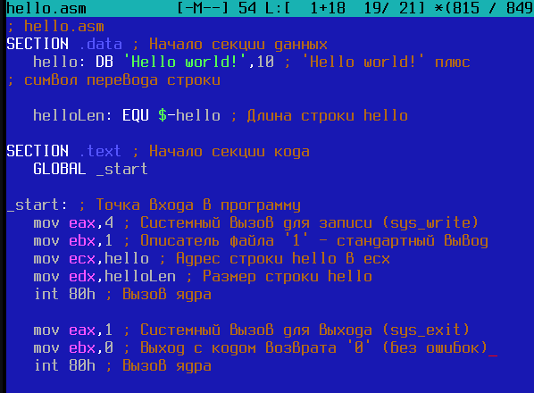
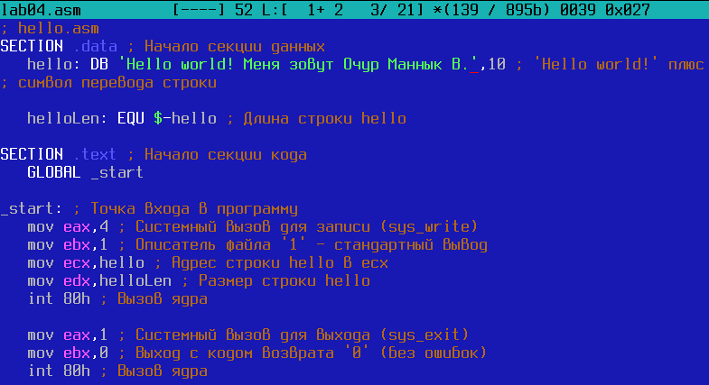
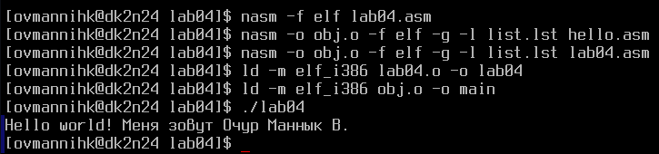
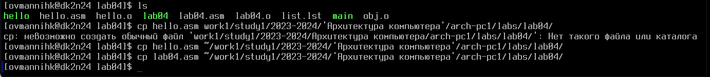

---
## Front matter
title: "Cоздание и процесс
обработки программ на языке ассемблера NASM"
subtitle: "Лабораторная работа No4."
author: "Маннык Очур Викторович"

## Generic otions
lang: ru-RU
toc-title: "Содержание"

## Bibliography
bibliography: bib/cite.bib
csl: pandoc/csl/gost-r-7-0-5-2008-numeric.csl

## Pdf output format
toc: true # Table of contents
toc-depth: 2
lof: true # List of figures
lot: true # List of tables
fontsize: 12pt
linestretch: 1.5
papersize: a4
documentclass: scrreprt

## I18n polyglossia
polyglossia-lang:
  name: russian
  options:
	- spelling=modern
	- babelshorthands=true
polyglossia-otherlangs:
  name: english

## I18n babel
babel-lang: russian
babel-otherlangs: english

## Fonts
mainfont: PT Serif
romanfont: PT Serif
sansfont: PT Sans
monofont: PT Mono
mainfontoptions: Ligatures=TeX
romanfontoptions: Ligatures=TeX
sansfontoptions: Ligatures=TeX,Scale=MatchLowercase
monofontoptions: Scale=MatchLowercase,Scale=0.9

## Biblatex
biblatex: true
biblio-style: "gost-numeric"
biblatexoptions:
  - parentracker=true
  - backend=biber
  - hyperref=auto
  - language=auto
  - autolang=other*
  - citestyle=gost-numeric

## Pandoc-crossref LaTeX customization
figureTitle: "Рис."
tableTitle: "Таблица"
listingTitle: "Листинг"
lofTitle: "Список иллюстраций"
lotTitle: "Список таблиц"
lolTitle: "Листинги"

## Misc options
indent: true
header-includes:
  - \usepackage{indentfirst}
  - \usepackage{float} # keep figures where there are in the text
  - \floatplacement{figure}{H} # keep figures where there are in the text
---

# Цель работы

Освоение процедуры компиляции и сборки программ, написанных на ассемблере NASM.

# Порядок выполнения лабораторной работы
## Программа Hello world!

Рассмотрим пример простой программы на языке ассемблера NASM. Традиционно первая
программа выводит приветственное сообщение Hello world! на экран.

Создайте каталог для работы с программами на языке ассемблера NASM:

`mkdir -p ~/work/arch-pc/lab04`

Перейдите в созданный каталог

`cd ~/work/arch-pc/lab04`

Создайте текстовый файл с именем hello.asm

`touch hello.asm`

	откройте этот файл с помощью любого текстового редактора, например, gedit

`gedit hello.asm`

и введите в него следующий текст:

## Транслятор NASM
NASM превращает текст программы в объектный код. Например, для компиляции приведённого выше текста программы «Hello World» необходимо написать:

`nasm -f elf hello.asm`

## Расширенный синтаксис командной строки NASM

`nasm -o obj.o -f elf -g -l list.lst hello.asm`

## Компоновщик LD
Как видно из схемы на рис. 4.3, чтобы получить исполняемую программу, объектный файл необходимо передать на обработку компоновщику:

`ld -m elf_i386 hello.o -o hello`

С помощью команды ls проверьте, что исполняемый файл hello был создан. Компоновщик ld не предполагает по умолчанию расширений для файлов, но принято использовать следующие расширения:

- o – для объектных файлов;
- без расширения – для исполняемых файлов;
- map – для файлов схемы программы;
- lib – для библиотек.

Ключ -o с последующим значением задаёт в данном случае имя создаваемого исполняемого файла.
Выполните следующую команду:

`ld -m elf_i386 obj.o -o main`

# Запуск исполняемого файла
Запустить на выполнение созданный исполняемый файл, находящийся в текущем каталоге, можно, набрав в командной строке:

`./hello`

# Задание для самостоятельной работы

1. В каталоге ~/work/arch-pc/lab04 с помощью команды cp создайте копию файла

`hello.asm с именем lab4.asm`

2. С помощью любого текстового редактора внесите изменения в текст программы в файле lab4.asm так, чтобы вместо Hello world! на экран выводилась строка с вашими фамилией и именем.

3. Оттранслируйте полученный текст программы lab4.asm в объектный файл. Выполните
компоновку объектного файла и запустите получившийся исполняемый файл.

4. Скопируйте файлы hello.asm и lab4.asm в Ваш локальный репозиторий в каталог ~/work/study/2023-2024/"Архитектура компьютера"/arch-pc/labs/lab04/.
Загрузите файлы на Github.

# Вывод

Освоил процедуры компиляции и сборки программ, написанных на ассемблере NASM.
